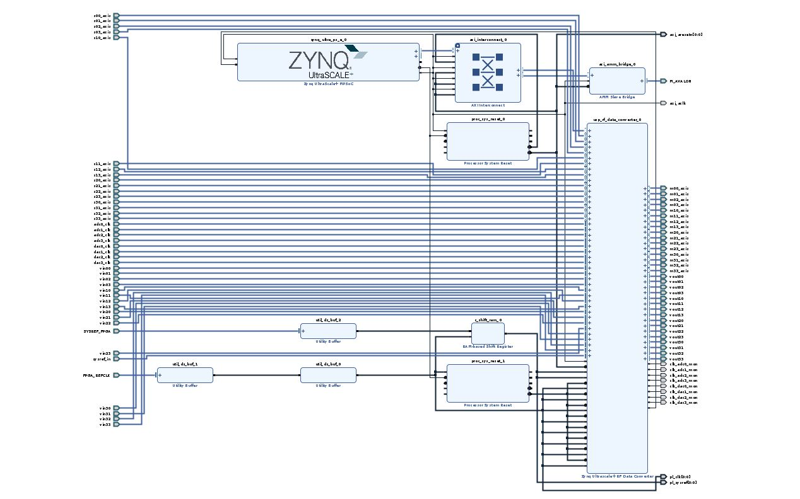
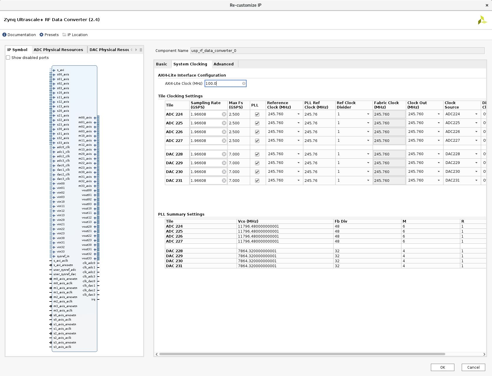

# DAC-ADC Loopback Testing on Zynq UltraScale+ RFSoC RF Data Converter

The purpuse of the design is to simulate and verify the output signal (pulse) from the DAC output and DAC-ADC loopback.

There are 16 channels connected to DACs and ADCs of the RF Data Converter IP, with 1.96608 (GSPS) Sampling Rate and 245.760 (MHz) Reference Clock.

  
  

   
  

\
DAC input pattern is configurable by the case statement inside the fpga_top.sv, it is adjusted to drive 6 samples (=3ns pulse) every 32 clock cycles.

The customized interface board is used for connectivity between the DAC output channel of the FPGA to the oscilloscope, and also to connect the ADC input channel to the FPGA for loopback testing.

[IMAGES]

ADD ABOUT ILA CORES + CHIPSCOPE

Device: XCZU49DR
\
Vivado Version: 2020.2
